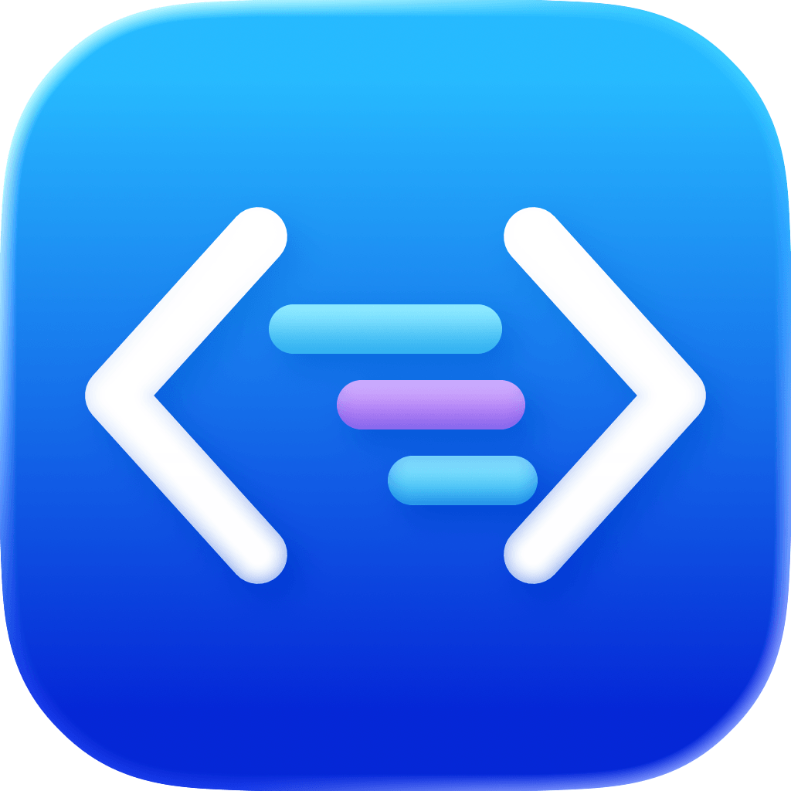
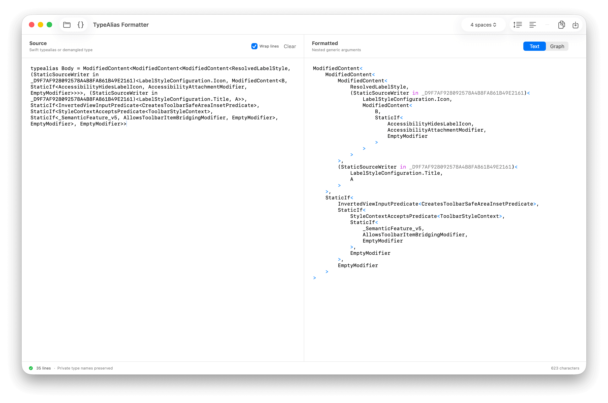

<p align="center">
  
</p>

<h1 align="center">TypeAlias Formatter</h1>

A native macOS utility that formats nested Swift typealiases and demangled type
names. It preserves private names such as `(Modifier in _123ABC)<Style>`.



## Use

Paste one typealias or type in the source pane. The output updates as you type.
The converter removes a leading `typealias Name =` declaration before parsing.
The app starts with the complete `DefaultLabelStyle.Body` example.

- Multiple generic arguments use separate lines and four-space indentation.
- Choose **2 spaces**, **4 spaces**, **8 spaces**, or **Tab** for indentation.
  Tab uses one tab character per level and displays at four-space tab stops.
- Single-argument generics stay on one line unless a child needs multiple lines.
- Use **Expand generics** to expand single-argument generics in text too.
- **Text** shows the formatted type without a declaration header or code fence.
- **Graph** shows connected type nodes in argument order. Click a node to expand
  or collapse its children. Use the zoom controls or **Fit** to inspect the tree.
- Graphs initially show two levels of arguments. **Expand all** shows every node.
- Copy or save Text as plain text (`.txt`), or the visible Graph as SVG (`.svg`).
- Use **Open** to load a UTF-8 `.swift`, `.md`, or `.txt` file.
- The source editor wraps lines by default. Turn off **Wrap lines** to scroll
  horizontally. This setting and the indentation choice persist across launches.
  The output editor scrolls horizontally to preserve deep indentation.

Shortcuts: **⌘O** opens a file, **⌘Return** formats the input, **⇧⌘C** copies
the output, and **⌘S** saves it.

The formatter checks delimiters, empty arguments, and Markdown fences. It keeps
function arrows, tuples, collection types, and type suffixes intact. This is a
type layout tool, not a Swift syntax validator. Format one declaration at a time
and remove comments first. Input is limited to 200 KB and 128 nesting levels.
All formatting runs locally. The app has no network dependency.

## Develop

Requires macOS 14 or later, Xcode 26 or later, and Tuist 4 with buildable folder
support. The initial project was verified with Tuist 4.206.0 and Xcode 26.6.

```sh
tuist generate --no-open
open TypeAliasFormatter.xcworkspace
```

Select the `TypeAliasFormatter` scheme and run the app. Edit `Project.swift` to
change the project. Generated Xcode files and build products are ignored by Git.
The project uses buildable folders, so new source files do not need regeneration.

The app icon source is `App/Resources/AppIcon.icon`. Open it in Icon Composer to
edit the four SVG layers, the background, or the material effects. Xcode generates
all icon sizes and appearances, including icons for older macOS releases, from
this file. See [Apple's Icon Composer documentation](https://developer.apple.com/documentation/xcode/creating-your-app-icon-using-icon-composer).

`AccentColor` in `App/Resources/Assets.xcassets` defines the app's blue accent for
light and dark appearances. The README icon is exported from Icon Composer to
`Documentation/Images/app-icon-composer.png`.

```sh
xcodebuild build \
  -workspace TypeAliasFormatter.xcworkspace \
  -scheme TypeAliasFormatter \
  -destination 'platform=macOS' \
  -derivedDataPath DerivedData
```

The formatting library is separate from the app. `Package.swift` exposes only
that library and its tests for fast checks without Xcode project generation:

```sh
swift test --filter TypeAliasFormatterTests
```

The `TypeAliasFormattingTests` Xcode scheme runs the same tests. Fixtures verify
the full reference layout after removing its declaration header and code fence.
Tests also cover graph structure, node layout, collapse behavior, and SVG output.
No third-party packages are required.

## Release

Push a tag in `vMAJOR.MINOR.PATCH` format, such as `v0.1.0`, to run the Release
workflow. It uses Xcode 26.6 and Tuist 4.206.0 to test the formatting library and
build a universal app for Apple Silicon and Intel. The app version comes from
the tag, and the build number comes from the workflow run number.

The workflow creates a GitHub Release and uploads
`TypeAliasFormatter-v<version>-macOS.zip`. The app requires macOS 14 or later.
Release builds use ad-hoc signing and are not notarized.

For a build check before tagging, run **Release** manually from the Actions tab
and enter the app version. Manual runs store the ZIP as a workflow artifact and
do not publish a GitHub Release.
